# Hi 🖐

My name is Fabrício. I live in São Paulo, Brazil.

I've been working with JavaScript/TypeScript (React, Next.js, Vue.js, Nuxt), C# (.NET), and PHP (Laravel) for over 6 years.

Currently, I am working at [@bejamas](https://github.com/bejamas) (Poland, remote) and at my own company, [@fabrecostudio](https://github.com/fabrecostudio).

 

  
🧰 Things I code with

 

| Skill   | Technologies |
|---------|--------------|
| Backend |      |
| JS/TS ecosystem |      |
| Frontend |      |
| SQL |   | 
| noSQL | 
| Package Manager |     |
| Version Control System (VCS) |  |
| Code hosting |  
| Servers |    |
| Continuous Integration (CI) |   |
| Cloud |   |
| Agile |  |
| Testing |    |
| Code Quality |    |
| Shells |  |

  
📈 My stats

  
  

